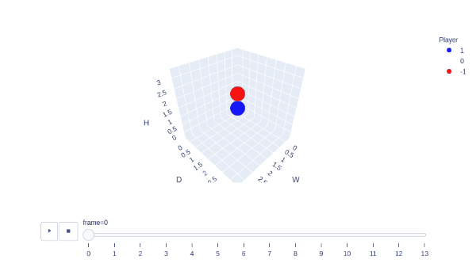

# 3d-connect4-gym

[![BuildStatus][build-status]][ci-server]
[![PackageVersion][pypi-version]][pypi-home]
[![PythonVersion][python-version]][python-home]
[![Stable][pypi-status]][pypi-home]
[![Format][pypi-format]][pypi-home]
[![License][pypi-license]](LICENSE)



[build-status]: https://travis-ci.org/youngeek-0410/3d-connectX-env.svg?branch=master
[ci-server]: https://travis-ci.org/youngeek-0410/3d-connectX-env
[pypi-version]: https://badge.fury.io/py/3d-connectX-env.svg
[pypi-license]: https://img.shields.io/pypi/l/3d-connectX-env.svg
[pypi-status]: https://img.shields.io/pypi/status/3d-connectX-env.svg
[pypi-format]: https://img.shields.io/pypi/format/3d-connectX-env.svg
[pypi-home]: https://badge.fury.io/py/3d-connectX-env
[python-version]: https://img.shields.io/pypi/pyversions/3d-connectX-env.svg
[python-home]: https://python.org

3D connectX repository, developed for the [OpenAI Gym](https://github.com/openai/gym) format.

## Installation

The preferred installation of `3d-connectX-env` is from `pip`:

```shell
pip install 3d-connectX-env
```

## Usage

### Python

```python
from gym_3d_connectX.envs import AnyNumberInARow3dEnv

env = AnyNumberInARow3dEnv()
env.reset()

env.utils.win_reward = 100
env.utils.draw_penalty = 50
env.utils.lose_penalty = 100
env.utils.could_locate_reward = 10
env.utils.couldnt_locate_penalty = 10
env.utils.time_penalty = 1
env.player = 1
actions = [0, 0, 1, 1, 2, 2, 4, 4, 0, 0, 1, 1, 2, 2, 0, 3]

for action in actions:
    obs, reward, done, info = env.step(action)
    env.render(mode="plot")

```

## Environments

The environments only send reward-able game-play frames to agents; 
No cut-scenes, loading screens, etc. are sent to 
an agent nor can an agent perform actions during these instances.

Environment: `3d-connectX-v0`

### Factor at initialization.

| Key                     | Type     | Description
|:------------------------|:---------|:------------------------------------------------------|
| `num_grid   `           | `int`    | Length of a side.
| `num_win_seq`           | `int`    | The number of sequence necessary for winning.
| `win_reward`            | `float`  | The reward agent gets when win the game.
| `draw_penalty`          | `float`  | The penalty agent gets when it draw the game.
| `lose_penalty`          | `float`  | The penalty agent gets when it lose the game.
| `couldnt_locate_penalty`| `float`  | The penalty agent gets when it choose the location where the stone cannot be placed.
| `could_locate_reward`   | `float`  | The additional reward for agent being able to put the stone.
| `time_penalty`          | `float`  | The penalty agents gets along with timesteps.
| `first_player`          | `int`    | Define which is the first player.

## Step

Info about the rewards and info returned by the `step` method.

| Key                | Type     | Description
|:-------------------|:---------|:------------------------------------------------------|
| `turn`             | `int`    | The number of the player at this step
| `winner`           | `int`    | Value of the player on the winning side
| `is_couldnt_locate`| `bool`   | In this step the player chooses where to place the stone.
